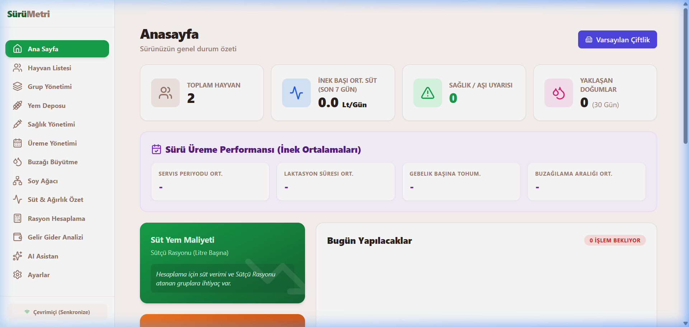
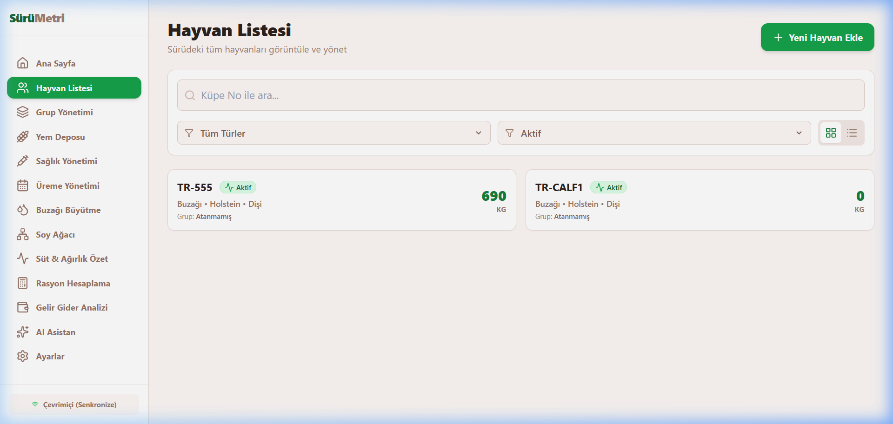
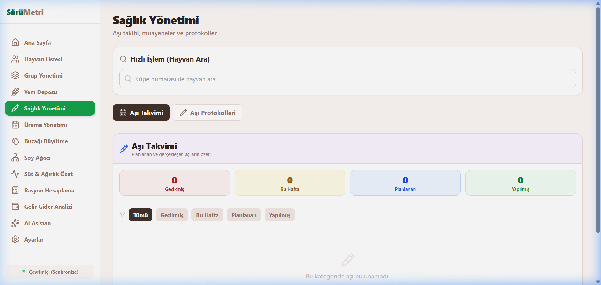
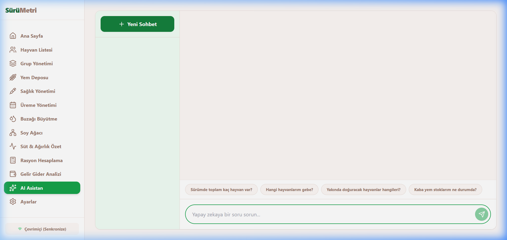

<div align="center">

# 🐄 SürüMetri

### Akıllı Sürü Yönetim Sistemi

**Süt ve besi sığırcılığı işletmeleri için geliştirilmiş,  
tam kapsamlı, çevrimdışı-öncelikli yönetim platformu.**

[](https://react.dev)
[](https://www.typescriptlang.org)
[](https://supabase.com)
[](https://vercel.com)
[](https://web.dev/progressive-web-apps)

**[🌐 Canlı Demo →](https://suru-yonetim.vercel.app)**

</div>

---

## 📸 Ekran Görüntüleri

<table>
  <tr>
    <td align="center"><b>🏠 Ana Sayfa</b></td>
    <td align="center"><b>🐄 Hayvan Listesi</b></td>
  </tr>
  <tr>
    <td></td>
    <td></td>
  </tr>
  <tr>
    <td align="center"><b>💉 Sağlık Yönetimi</b></td>
    <td align="center"><b>🤖 AI Asistan</b></td>
  </tr>
  <tr>
    <td></td>
    <td></td>
  </tr>
</table>

---

## ✨ Özellikler

### 🐮 Hayvan & Sürü Yönetimi
- Küpe numarası, ırk, cinsiyet, doğum tarihi ve ebeveyn bilgileri ile tam hayvan kaydı
- Grup bazlı sürü organizasyonu ve filtreleme
- Satış takibi ve durum yönetimi (Aktif / Satıldı / Hasta)

### 🌳 Soy Ağacı
- 3 nesil boyunca görsel ebeveyn-yavru ilişkisi haritası
- Anne ve baba tarafı ayrı ayrı izlenebilir

### 🥛 Süt & Ağırlık Takibi
- Günlük süt kaydı (litre, yağ %, protein %, somatik hücre)
- Laktasyon eğrisi grafikleri ve 7 günlük ortalama hesabı
- Canlı ağırlık kayıtları ve ADG (günlük canlı ağırlık artışı) hesabı

### 🌾 Yem Deposu & Rasyon Hesaplama
- Yem stoğu yönetimi, giriş/çıkış hareketleri ve minimum stok uyarısı
- Grup bazlı otomatik rasyon hesaplama (KM, ME, HP bazlı)
- Günlük sürü yem maliyeti ve süt başına maliyet hesabı

### 💉 Sağlık Yönetimi
- Tedavi, aşı ve veteriner ziyareti kayıtları
- Özelleştirilebilir aşı protokol şablonları ve otomatik planlama
- İlaç arınma süresi takibi ve uyarılar

### 🔬 Üreme Yönetimi
- Kızgınlık, tohumlama, gebelik kontrolü ve doğum takibi
- Servis periyodu, laktasyon süresi ve buzağılama aralığı istatistikleri
- Akıllı takvim ile yaklaşan doğum ve kontrol bildirimleri

### 🍼 Buzağı Büyütme
- Doğum ağırlığı, ağız sütü verimi ve sütten kesim hedefi takibi
- Gelişim grafiği ve hedefe ulaşma durumu

### 💰 Gelir & Gider Analizi
- Süt satışı, hayvan satışı ve diğer gelirler
- Yem, sağlık ve genel gider kayıtları
- Aylık kâr/zarar özeti ve grafikleri

### 🤖 AI Asistan
- Sürü verilerini analiz edip önerilerde bulunan yapay zeka asistanı
- Sohbet geçmişi ve çoklu oturum desteği

### 📤 Dışa / İçe Aktarım
- Tüm modüllerde **PDF** ve **Excel (XLSX)** çıktısı
- Excel şablonu ile toplu veri yükleme

---

## 🏗️ Mimari

```
SürüMetri
├── Offline-First (Dexie.js / IndexedDB)
│   └── İnternet olmadan da tam çalışır
├── Bulut Senkronizasyon (Supabase Postgres)
│   └── Online olunca otomatik senkronizasyon
├── Çoklu Çiftlik Desteği
│   └── Tek hesapla birden fazla çiftlik
└── PWA (Progressive Web App)
    └── iOS, Android, Windows masaüstüne kurulabilir
```

---

## 🛠️ Teknoloji Yığını

| Katman | Teknoloji |
|--------|-----------|
| **Frontend** | React 18, TypeScript, Vite |
| **Stil & UI** | Tailwind CSS, Lucide React |
| **Grafikler** | Recharts |
| **Durum Yönetimi** | Zustand |
| **Yerel Veritabanı** | Dexie.js (IndexedDB) |
| **Backend & Auth** | Supabase (PostgreSQL + Auth) |
| **AI** | DeepSeek API |
| **PDF & Excel** | jsPDF, xlsx |
| **PWA & Deploy** | Vite PWA Plugin, Vercel |

---

## 🚀 Kurulum

### Ön Koşullar
- Node.js 18+
- Supabase hesabı

### 1. Projeyi Klonlayın
```bash
git clone https://github.com/Barisozknn/Suru-Yonetim.git
cd Suru-Yonetim
```

### 2. Bağımlılıkları Yükleyin
```bash
npm install
```

### 3. Ortam Değişkenlerini Ayarlayın
`.env.example` dosyasını kopyalayıp `.env.local` adıyla kaydedin:
```bash
cp .env.example .env.local
```

`.env.local` dosyasını düzenleyin:
```env
VITE_SUPABASE_URL=https://xxxxx.supabase.co
VITE_SUPABASE_ANON_KEY=your_anon_key
VITE_DEEPSEEK_API_KEY=your_deepseek_key   # Opsiyonel - AI özelliği için
```

### 4. Supabase Veritabanını Kurun
Supabase projenizde **SQL Editor → New Query** açın ve [`supabase/schema.sql`](supabase/schema.sql) dosyasının içeriğini yapıştırıp **Run**'a basın.

> Bu dosya tüm tabloları, RLS güvenlik politikalarını ve ilişkileri içerir. Tek seferlik çalıştırmanız yeterlidir.

### 5. Uygulamayı Başlatın
```bash
npm run dev
```

Uygulama `http://localhost:5173` adresinde çalışacaktır.

---

## 📱 PWA Kurulumu

SürüMetri, tüm cihazlara yerel uygulama gibi kurulabilir:

- **iOS:** Safari → Paylaş → Ana Ekrana Ekle
- **Android:** Chrome → Menü → Uygulamayı Yükle
- **Windows/Mac:** Chrome adres çubuğundaki yükle ikonuna tıklayın

---

## 📄 Lisans

Bu proje özel kullanım amaçlıdır. Tüm hakları saklıdır.

---

<div align="center">
  <sub>🐄 SürüMetri — Akıllı, Hızlı, Her Yerde</sub>
</div>
